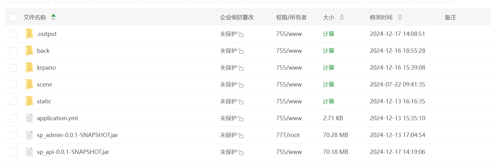
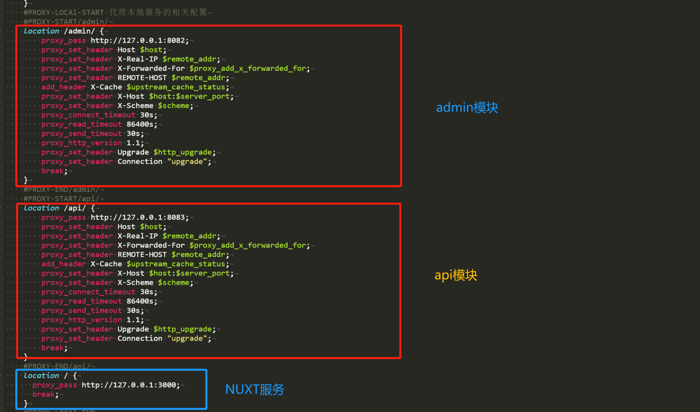

# 半夏全景

    
    <a href='https://gitee.com/jiang_zhenhua/sp_panorama/stargazers'>
        </img>
    </a>
    <a href='https://gitee.com/jiang_zhenhua/sp_panorama/members'>
        </img>
    </a>

[comment]: <> ([宽屏预览]&#40;https://gitee.com/jiang_zhenhua/sp_panorama/blob/master/README.md&#41;)

    <a href="https://gitee.com/jiang_zhenhua/sp_panorama/blob/master/README.md">宽 屏 预 览 文 档</a>

    <a href="https://panorama.banxia.tech/">效 果 展 示</a>
    &nbsp
    <a href="https://panorama.banxia.tech/space/2">内 页 展 示</a>

    如果对您有帮助，您可以点右上角 "Star" ❤️ 支持一下 谢谢！

### 📖 简介：

半夏全景商城系统Java版，基于Java+Vue+TS开发，在微信公众号、小程序、H5移动端都能使用，代码全开源无加密，独立部署，二开很方便，还支持免费商用，能满足企业新零售多种经营需求，自用、做二开项目都很合适。

### 💻 运行环境及框架：
~~~
1. 后台服务 Java SpringBoot + Mybatis-plus + Mysql + redis + RabbitMQ + MongoDB
2. 运行环境 linux和windows等都支持,只要有Java环境和对应的数据库 redis
3. 运行条件 Java 1.8 Mysql5.7 node18
4. Api对应的接口文档也可以部署项目后查看    域名/doc.html 查看【knife4j生成】
~~~

### 🔧 Java项目框架 和 项目运行环境
#### 后端依赖
~~~
*   SpringBoot 2.7.13 
*   Mybatis Plus LATEST
*   knife4j
*   Redis
*   SLF4j+log4j
*   Redis
*   Fastjson
*   Lombok
*   knife4j
*   krpano-1.19 
~~~
#### 前端依赖
~~~
*   Vue3      
*   ElementPlusUi 
*   TypeScript
*   NUXT
~~~

---

### 🧭 项目代码包介绍
~~~
├─application               应用目录
│  ├─sp_common              公共模块
│  ├─sp_admin               管理员模块【默认端口8080】
│  └─sp_api                 用户模块 【默认端口8081】
├─admin-vue                 管理后台(PC端管理端 VUE + ElementUi)
│  ├─src                    核心包
│  │  ├─libs                公告模块
|  |  |  ├─app.config.ts    配置文件              
├─front-vue                 使用nuxt 开发的用户端
│  ├─src                    核心包
│  │  ├─libs                公告模块
|  |  |  ├─app.config.js    配置文件   
├─krpano                    krpano
├─stitic                    静态素材
│  ├─scene                  全景素材
└─mysql                     数据库备份文件
~~~

### 🎬 系统演示：
后台账号： admin/123123【默认密码】【线上预览密码不提供，慎防被攻击抱歉】

### 📷 项目截图：

### 构建目录

### Nginx部署配置
